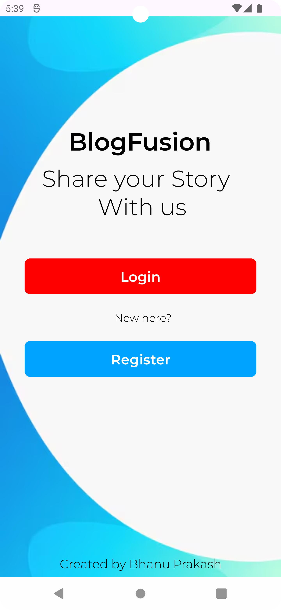
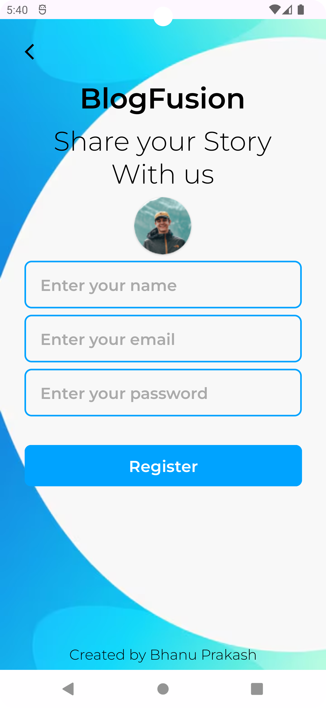
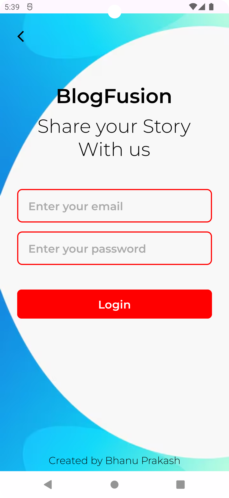
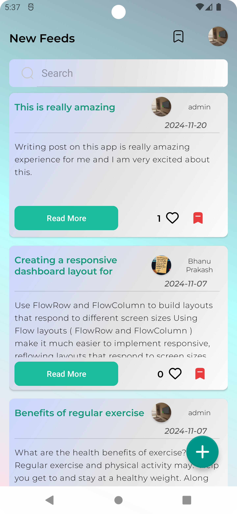
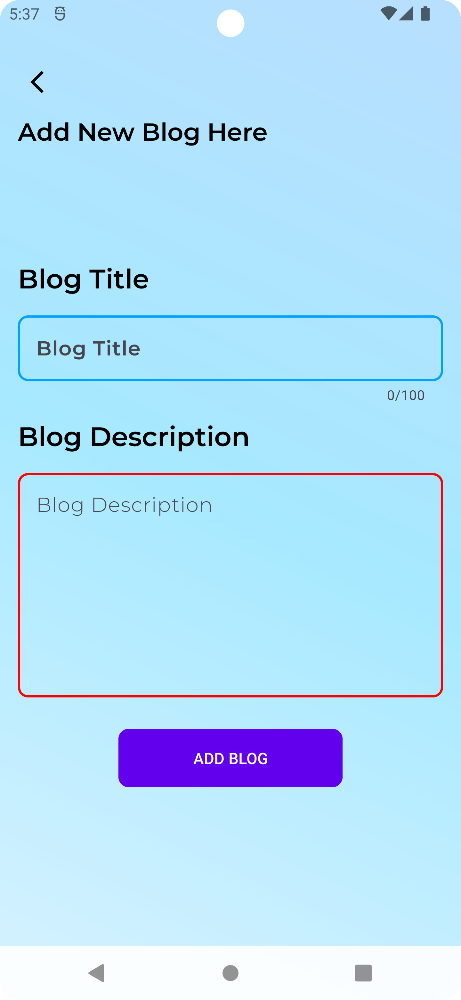
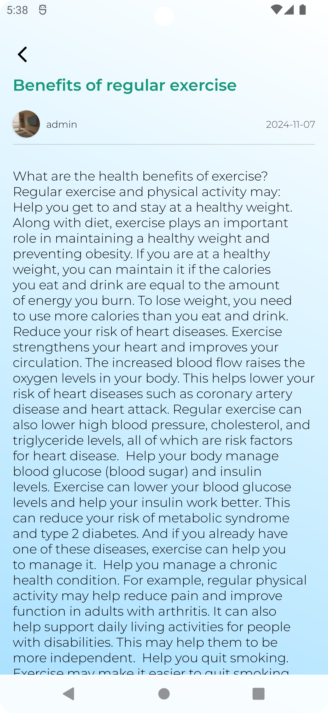
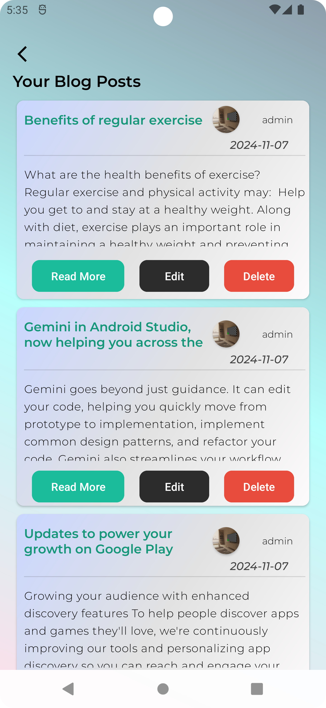
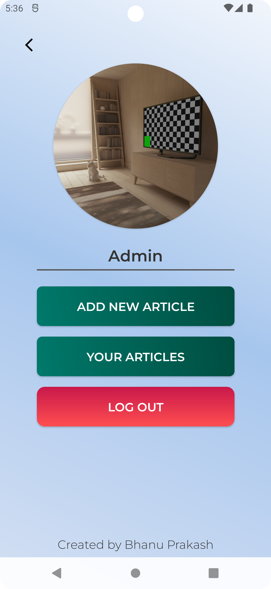

---

# BlogFusion

A full-featured BlogApp designed to allow users to create, read, update, and delete blog posts, with additional features like saving posts, liking content, and expanding to read more. This app provides an interactive platform for sharing stories, thoughts, and ideas.

## Table of Contents
- [Features](#features)
- [Tech Stack](#tech-stack)
- [Setup](#setup)
- [Usage](#usage)
- [Screenshots](#screenshots)
- [Contributing](#contributing)

## Features
- **User Registration and Login**: Secure user authentication system with email and password.
- **Create/Edit/Delete Posts**: Allows users to create new blog posts, edit existing posts, and delete them.
- **Like Posts**: Users can like posts, promoting popular content.
- **Save Posts**: Option to save posts for later reading, enhancing user engagement.
- **Read More**: Expands content to show the full blog post when reading.
- **User-Friendly Interface**: Intuitive UI for both posting and browsing content.
- **Responsive Design**: Accessible on both mobile and desktop.
- **Background Image and Custom Fonts**: Visual design elements to enhance the reading and writing experience.

## Tech Stack
- **Frontend**: XML Layouts, Kotlin, Android SDK
- **Backend**: Firebase Database
- **Libraries**: 
  - ConstraintLayout for responsive layouts
  - Firebase Database is used for all data storage and user authentication

## Setup
1. **Clone the Repository**:
    ```bash
    git clone https://github.com/yourusername/BlogFusion.git
    cd BlogFusion
    ```

2. **Open in Android Studio**:
   - Open Android Studio and select "Open an existing project".
   - Navigate to the cloned project directory.

3. **Configure Firebase**:
   - Follow [Firebase's documentation](https://firebase.google.com/docs/android/setup) to set up Firebase for your app.
   - Download the `google-services.json` file and place it in the `app` directory.

4. **Build and Run**:
   - Sync the project with Gradle files.
   - Run the app on an Android emulator or physical device.

## Usage
- **Sign Up**: Register by entering your name, email, and password.
- **Login**: Use your registered email and password to log in.
- **Create a Blog Post**: Navigate to the "New Post" section to create a blog.
- **Like Posts**: Tap the "Like" button on posts to promote content.
- **Save Posts**: Use the "Save" button to mark posts for later reading.
- **Read More**: Click on the "Read More" button to expand posts and view full content.
- **Edit/Delete Posts**: Access your posts and either edit or delete them as needed.

<p align="center">
  
  
  
  
  
  
  
  
</p>


## Contributing
Contributions are welcome! Please open an issue or submit a pull request for any improvements.

1. Fork the project.
2. Create your feature branch (`git checkout -b feature/NewFeature`).
3. Commit your changes (`git commit -m 'Add new feature'`).
4. Push to the branch (`git push origin feature/NewFeature`).
5. Open a pull request.


---
